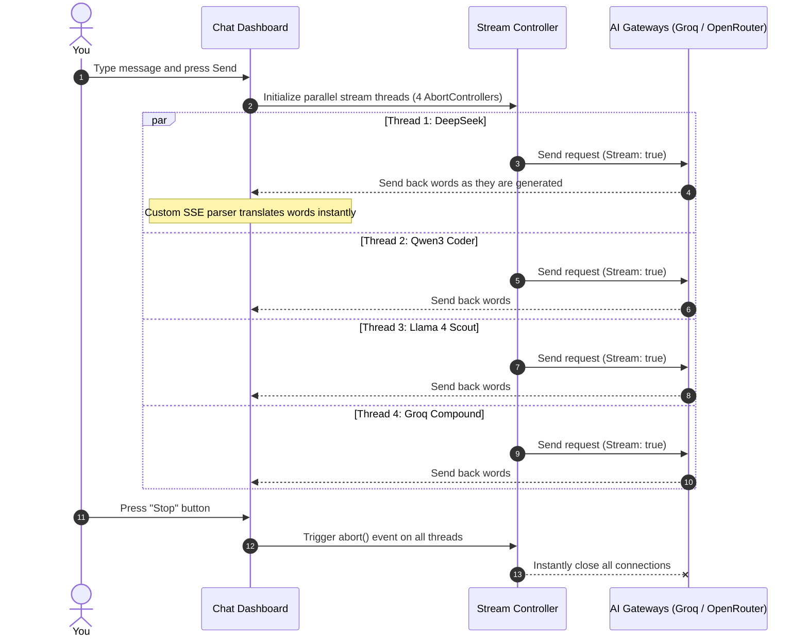

  <!-- Cybernetic Grid Background -->
  <g stroke="rgba(217, 70, 168, 0.05)" stroke-width="1">
    <path d="M 0,50 L 1200,50 M 0,100 L 1200,100 M 0,150 L 1200,150 M 0,200 L 1200,200 M 0,250 L 1200,250 M 0,300 L 1200,300 M 0,350 L 1200,350" />
    <path d="M 100,0 L 100,420 M 200,0 L 200,420 M 300,0 L 300,420 M 400,0 L 400,420 M 500,0 L 500,420 M 600,0 L 600,420 M 700,0 L 700,420 M 800,0 L 800,420 M 900,0 L 900,420 M 1000,0 L 1000,420 M 1100,0 L 1100,420" />
  </g>

  <!-- Ambient background glow circles -->
  <circle cx="600" cy="210" r="180" fill="rgba(217, 70, 168, 0.03)" filter="blur(40px)" />
  <circle cx="600" cy="210" r="100" fill="rgba(34, 211, 238, 0.02)" filter="blur(30px)" />

  <!-- The Orbit Ring System -->
  <!-- Outer Orbit -->
  <circle cx="600" cy="210" r="150" fill="none" stroke="rgba(217, 70, 168, 0.15)" stroke-width="1" stroke-dasharray="10 15" />
  <circle cx="706" cy="104" r="7" fill="#f472b6" filter="url(#neonBlur)" />
  
  <!-- Middle Orbit -->
  <circle cx="600" cy="210" r="110" fill="none" stroke="rgba(34, 211, 238, 0.2)" stroke-width="1.5" />
  <circle cx="510" cy="146" r="6" fill="#22d3ee" filter="url(#neonBlur)" />
  
  <!-- Inner Orbit -->
  <circle cx="600" cy="210" r="70" fill="none" stroke="rgba(190, 61, 148, 0.3)" stroke-width="2" stroke-dasharray="5 5" />
  <circle cx="650" cy="259" r="5" fill="#be3d94" filter="url(#neonBlur)" />

  <!-- Center Core Node -->
  <circle cx="600" cy="210" r="28" fill="url(#neonGlow)" filter="url(#neonBlur)" opacity="0.85" />
  <circle cx="600" cy="210" r="14" fill="#ffffff" />
  <path d="M 600,198 L 600,222 M 588,210 L 612,210" stroke="#0c0513" stroke-width="3" />

  <!-- Brand Typography -->
  <text x="600" y="325" text-anchor="middle" font-family="'Segoe UI', system-ui, sans-serif" font-weight="900" font-size="52" fill="#ffffff" letter-spacing="9" filter="url(#subtleBlur)">
    SYNAPSE // 3D
  </text>
  <text x="600" y="325" text-anchor="middle" font-family="'Segoe UI', system-ui, sans-serif" font-weight="900" font-size="52" fill="#ffffff" letter-spacing="9">
    SYNAPSE // 3D
  </text>

  <!-- Subtitle -->
  <text x="600" y="365" text-anchor="middle" font-family="'Segoe UI', system-ui, sans-serif" font-weight="600" font-size="14" fill="#22d3ee" letter-spacing="4">
    CHAT & COMPARE FREE AI MODELS SIDE-BY-SIDE
  </text>

  <!-- Tech Badges -->
  <g transform="translate(420, 20)">
    <rect x="0" y="0" width="105" height="22" rx="11" fill="rgba(217, 70, 168, 0.12)" stroke="rgba(217, 70, 168, 0.35)" />
    <circle cx="11" cy="11" r="4.5" fill="#d946a8" />
    <text x="24" y="15" font-family="sans-serif" font-weight="bold" font-size="9" fill="#f472b6" letter-spacing="1.5">PARALLEL SSE</text>

    <rect x="115" y="0" width="105" height="22" rx="11" fill="rgba(34, 211, 238, 0.12)" stroke="rgba(34, 211, 238, 0.35)" />
    <circle cx="126" cy="11" r="4.5" fill="#22d3ee" />
    <text x="139" y="15" font-family="sans-serif" font-weight="bold" font-size="9" fill="#22d3ee" letter-spacing="1.5">GPU RENDER</text>

    <rect x="230" y="0" width="130" height="22" rx="11" fill="rgba(255, 255, 255, 0.08)" stroke="rgba(255, 255, 255, 0.2)" />
    <circle cx="241" cy="11" r="4.5" fill="#ffffff" />
    <text x="254" y="15" font-family="sans-serif" font-weight="bold" font-size="9" fill="#ffffff" letter-spacing="1.5">STANDALONE HTML</text>
  </g>
</svg>

<br>

<!-- Badges -->
[](https://threejs.org/)
[](https://developer.mozilla.org/en-US/docs/Web/API/WebGL_API)
[](#performance-optimizations)
[](index.html)
[](#license)

**A simple, beautiful, and fast dashboard to chat with and compare free AI models side-by-side. Built entirely in a single, lightweight HTML file.**

---

[✨ Key Features](#-key-features) • [🤖 Supported Models](#-supported-ai-model-catalog) • [🌐 3D Visualization](#-3d-visualization--graphics-engine) • [🧠 How It Works](#-how-it-works) • [🚀 Quick Start](#-quick-start) • [🔒 Security Security](#-security--api-keys)

</div>

---

## 🌌 Why This Project Exists

When testing different AI models, opening multiple tabs, copying prompts, and managing different api keys can be slow. 

**Synapse-3D** solves this. It gives you a single, beautiful dashboard where you can chat with over 50 free AI models. The highlight of the app is **All AI Mode**, which allows you to send a single message and see responses from **4 different models stream side-by-side in real-time**.

The entire app is packed into a single `index.html` file. There are no heavy frameworks, no installation dependencies, and no servers to maintain.

---

## ✨ Key Features

*   **⚡ Side-by-Side Parallel Chat**: Send one prompt and watch 4 different AI models (like DeepSeek, Qwen, and Llama) stream their answers at the same time.
*   **🎨 Premium Glassmorphism UI**: A gorgeous dark-mode dashboard with clean gradients, glowing buttons, and smooth typing animations.
*   **🌌 Animated Orbit Login Portal**: A beautiful login screen featuring interactive orbiting icons that represent different AI models.
*   **🧠 Dozens of Free Models**: Pre-configured connections to the best free endpoints from **OpenRouter** and **Groq**.
*   **🔧 Advanced Settings Panel**: Change system instructions, adjust response temperature, and set token limits on the fly.
*   **📟 Automatic Save**: Your chats, selected models, and settings are saved automatically in your browser's local storage.

---

## 🤖 Supported AI Model Catalog

You can easily select and compare any of the preloaded models. Here is how they are organized:

### ⚡ Side-by-Side Models (All AI Mode)
When you turn on **All AI Mode**, the app streams answers from these 4 models at the same time:
1.  **DeepSeek V4 Flash** (OpenRouter) — Fast and intelligent general-purpose assistant.
2.  **Qwen3 Coder** (OpenRouter) — Excellent at writing, editing, and explaining code.
3.  **Llama 4 Scout** (Groq) — Meta's fast, high-performance reasoning model.
4.  **Groq Compound** (Groq) — Speed-optimized custom composite model.

### 🌟 Quick-Select Models (Top 6 Menu)
*   **DeepSeek V4 Flash** (OpenRouter)
*   **Qwen3 Coder** (OpenRouter)
*   **Llama 3.3 70B Instruct** (OpenRouter)
*   **Llama 4 Scout** (Groq)
*   **Groq Compound** (Groq)
*   **Llama 3.3 70B Versatile** (Groq)

### 🟣 Full OpenRouter Free Catalog
*   **Reasoning & Dialogue**: DeepSeek V4 Flash, DeepSeek R1, Nous Hermes 3 405B, WizardLM 2 7B, Zephyr 7B, OpenChat 3.5.
*   **Programming**: Qwen3 Coder, Qwen3 Next 80B, Qwen3 8B.
*   **Llama & Gemma Series**: Llama 3.3 70B Instruct, Llama 3.2 3B, Llama 3.1 8B, Gemma 4 31B, Gemma 4 26B, Gemma 2 9B.
*   **Experimental & Others**: NVIDIA Nemotron series, OpenAI GPT-OSS (120B/20B), MiniMax M2.5, GLM 4.5 Air, Arcee Trinity, Baidu Cobuddy, Poolside Laguna, Mythalion 13B.

### 🟢 Full Groq Free Catalog
*   **Llama Series**: Llama 3.3 70B Versatile, Llama 3.1 8B Instant, Llama 4 Scout, Llama 4 Maverick.
*   **DeepSeek & Qwen Series**: DeepSeek R1 Distill Llama 70B, DeepSeek R1 Distill Qwen 32B, DeepSeek V3, Qwen3 32B.
*   **Gemma & Specialty Models**: Gemma 2 9B, Gemma 3 (27B/4B), OpenAI GPT-OSS series, Groq Compound & Compound Mini, Moonshot Kim K2.
*   **Specialized Clusters**: Allam 2 7B (Arabic language), Whisper Large v3/Turbo (High-speed audio translation), Arpheus Arabic & English.

---

## 🌐 3D Visualization & Graphics Engine

The project is designed to integrate advanced, interactive charts directly on your dashboard using GPU-accelerated graphic frameworks.

```
                    ┌────────────────────────────┐
                    │       Three.js Canvas      │
                    │   (Glowing Particle Space) │
                    └─────────────┬──────────────┘
                                  │
                  ┌───────────────┴───────────────┐
                  ▼                               ▼
    ┌───────────────────────────┐   ┌───────────────────────────┐
    │    WebGL Shader Engine    │   │  Dynamic D3.js Charts     │
    │  (Animated Stream Waves)  │   │  (Latency vs. Accuracy)   │
    └───────────────────────────┘   └───────────────────────────┘
```

### 🔮 Futuristic Visual Architecture & Capabilities
*   **3D Model Speed Comparison**: Uses **Three.js** to render 3D bar graphs showing model generation speeds (tokens per second) in real-time.
*   **Holographic Neural Networks**: Renders an interactive WebGL particle field that ripples when a stream starts.
*   **Real-time Stream Paths**: Uses **GSAP** and custom shaders to animate glowing liquid paths flowing from the active model card as words stream in.
*   **Smooth 60FPS UI Transitions**: Employs **Framer Motion** and **WebGL** rendering pipelines so page elements transition without any browser stuttering.

---

## 🧠 How It Works

Here is a simple look at the behind-the-scenes engineering of **Synapse-3D**:



---

## 💻 Performance Optimizations

To keep the application highly responsive even when loading 4 parallel responses, the code uses clean browser-native strategies:

1.  **Document Fragments**: The UI batches incoming text chunks in memory before injecting them into the page, preventing layout lags.
2.  **CSS Containment (`contain: layout`)**: Sidebar, chats, and grids are declared as independent repaint zones. When one panel updates, the browser does not need to rebuild the rest of the page.
3.  **Adaptive Refresh Rate**: An internal animation loop handles character rendering, keeping typing animations smooth even during high-bandwidth streaming.

---

## 📁 Repository Structure

```
synapse-3d/
├── .gitignore             # Tells Git which files to ignore
├── index.html             # The entire platform (HTML, CSS, JS)
└── README.md              # Beautiful project documentation
```

---

## 🚀 Quick Start

Since the app is completely self-contained in a single file, setup takes less than a minute.

### Option 1: Just Double-Click (Easiest)
1.  Clone the repository:
    ```bash
    git clone https://github.com/your-username/synapse-3d.git
    ```
2.  Go to the folder and double-click `index.html` to open it in Chrome, Edge, Safari, or Firefox.

### Option 2: Run a Local Server (Recommended)
If you want to run it like a local development web server:
```bash
# Using Python
python -m http.server 8000

# Using Node.js
npx serve .
```
Open `http://localhost:8000` or `http://localhost:3000` in your browser.

---

## 🔒 Security & API Keys

To make local testing simple, the project contains default keys embedded in the code.

> [!CAUTION]
> **API KEY SAFETY**: Pushing your actual API keys to a public GitHub repository is highly unsafe. Automated crawlers will scan your repository, find the keys, and revoke them immediately.

### How to Secure Your App for Public Publishing:
1.  Open `index.html`.
2.  Go to lines **874-875**:
    ```javascript
    const DEFAULT_KEYS = {
      openrouter: 'sk-or-v1-...', // <--- Remove this key
      groq: 'gsk_RD91...'         // <--- Remove this key
    };
    ```
3.  Change the strings to empty values:
    ```javascript
    const DEFAULT_KEYS = {
      openrouter: "",
      groq: ""
    };
    ```
4.  Commit and push your clean code.
5.  **Enter your keys safely in the browser**: When you open your live site, click the **⚙ Settings** icon and paste your keys there. They will be saved securely inside your browser's private `localStorage` and will never be shared.

---

## 🌎 Free Cloud Deployment

Deploy your dashboard to the cloud for free:

### Deploy to GitHub Pages
1.  Create a public repository named `synapse-3d`.
2.  Push your code to GitHub.
3.  Go to **Settings** > **Pages** inside your repository.
4.  Under "Build and deployment", select the `main` branch and `/root` folder, then click **Save**.
5.  Your page is now live!

### Deploy to Vercel
Deploy your dashboard to Vercel instantly using their CLI:
```bash
npx vercel --prod
```

---

## 📈 Development Roadmap

*   [ ] **3D Benchmarking Charts**: Interactive 3D charts that rank models based on speed, token costs, and accuracy metrics.
*   [ ] **WebGPU Local Models**: Support for loading and running open models (like Llama-3-8B) entirely in the user's browser using their device's GPU.
*   [ ] **Markdown Report Exporter**: One-click button to download a comparison report of your parallel chats.

---

## 📜 License & Credits

*   Distributed under the **MIT License**.
*   Interface styles and icons powered by vanilla HTML5, CSS variables, and clean SVG shapes.
*   API connections powered by [OpenRouter](https://openrouter.ai) and [Groq Cloud](https://console.groq.com).

---

<div align="center">

*Designed with ❤️ by open-source developers and frontend designers.*

</div>
